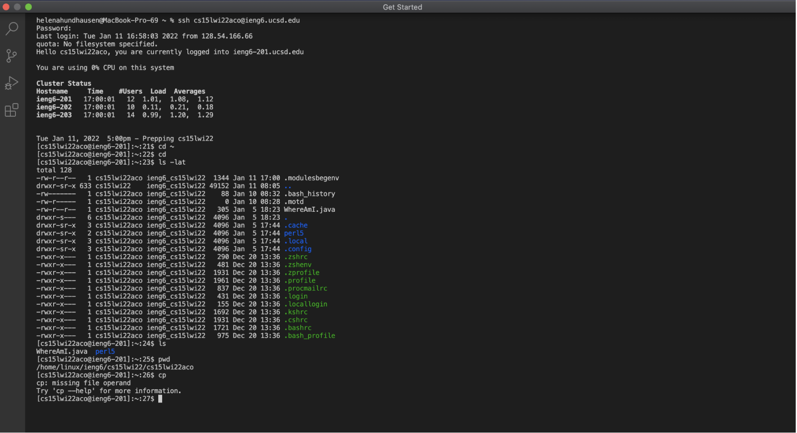
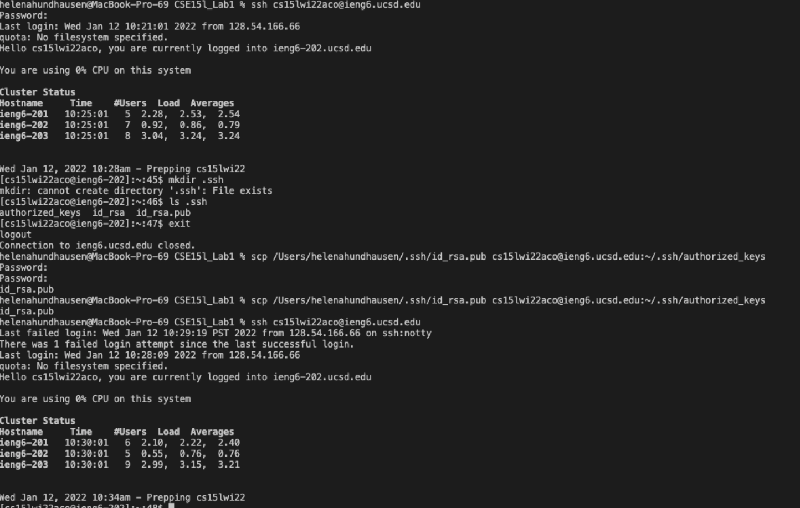
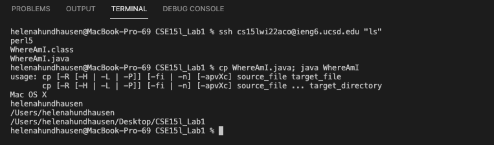

**Week 2 Lab Report 1 by Helena Hundhausen** 
======================================================
Logging Into A Course-Specific Account On ieng6

---

*Background*    : 

Software engineers often do not have the space to accommodate their company's large amounts of data on their local machines, so they must access it from a remote machine using a personalized account. Moreover, when working with a large amount of data in the tech industry, accessing a remote machine may be necessary. 

Thus, to understand how this process works, this lab and the steps below demonstrate how to gain access to a computer in the CSE basement using a CSE15L course-specific ieng6 account. 

*Step One*    : Installing Visual Studio Code 

Installing Visual Studio Code, an Integration Development Environment (IDE), is important because this lab uses its integrated terminal palette to access our CSE15L course-specific account on iegn6 and complete the remaining steps in this lab. 

>To download and install VS Code: 
1. Depending on the computer you're using, different versions of VS Code are available. For the link to all versions, click [here](https://code.visualstudio.com/Download)! 
2. Now, click [here](https://code.visualstudio.com/docs/setup/setup-overview) for more information on the steps needed to finish installing VS Code onto the type of computer it's downloaded on!
3. Once fully installed, you'll be able to open a window very similar to the screenshot below...
* * Note that I've changed specific settings in my VS Code, so my screenshot may look slightly different from the window you have opened 

*Step Two*   : Remotely Connnecting 

We must obtain a course-specific account to connect to the computer in the CSE basement. 

>If you haven't found your account yet, follow these steps: 
1. Click here for [account lookup!](https://sdacs.ucsd.edu/~icc/index.php) 
2. Enter your AD and Username 
3. Find the CSE15L ieng6 specific version; it should look like "cs15lwi22aco"
* * Remember: the letters aco should be replaced with your particular combination 
4. Click on the username to reset the password 
* * To avoid problems in the following steps, make the password short and straightforward while still secure 

>If you've gained access to your account, follow the steps below to establish a new terminal in VS code and enable a secure connection to the remote computer using a command called ssh. 
1. Open a new terminal in VS Code 
2. Insert the command ssh along with your course-specific account ending with @ieng6.ucsd.edu to get the remote location
* * It should look like the following: **ssh cs15lwi22aco@ieng6.ucsd.edu** (be sure to replace *aco* with your specific three-letter sequence) 

* * * To save time, I recommend keeping this in a place where you can copy and paste it rather than having to type it out every time

3. Enter the password previously created 
* * If you're having trouble with this step, please understand...
* * * It takes about 15-20min for the password to reset
* * * There could be minimal typos, so go back and check previous lines 

4. If you successfully log in, you'll receive a bunch of account-specific information 
* * For reference, the information that appears should resemble what is seen in the screenshot below, beginning on line 3

Your terminal is now connected to a computer in the CSE basement!

*Step Three* : Trying Some Commands 

One important and noteworthy feature of the ssh command is that commands on your local computer will be executed on the remote computer while connected to the secure connection it establishes. The screenshot below provides a demonstration where I tested many different commands for fun. 

Feel free to experiment on your VSCode! 

*Step Four*  : Moving Files with scp 

Another interesting and essential feature for working remotely is transferring files back and forth between computers using a command called SCP.

>To move files... 
1. Make sure you're not logged into the remote computer 
2. Create a .java file on your computer 
*  * Feel free to copy the WhereAmI.java file on the screenshot below
3. Log into the terminal from the directory where the file was made and run the command below with your personal username to log back into the remote computer
* * scp WhereAmI.java cs15lwi22aco@ieng6.ucsd.edu:~/
4. Enter your password 
5. Use the command ls to list the file 

Also, an visual example can found in the screenshot below which shows a file named **WhereAmI.java** that I copied to log in and run on the remote computer located in the CSE dungeon using SCP. 

However, this command takes a long time, and if you had to run it throughout a PA or anything else, simply checking to see whether you had the required output would be very time-consuming. 

*Step Five*  : Setting an SSH Key 

Every time we've had to log in or run scp, a password that isn't visible had to be typed for security purposes. Yet, a helpful command called ssh-keygen allows us not to have to type a password for ssh. 

Additionally, the command creates a pair of files on your local computer called: 
 - public key(stored in a file id_rsa.pub) 
 - private key(stored in a file id_rsa) 

The first screenshot below shows the steps to complete the first part of using ssh-keygen by generating the public key and private key.  

- But, before continuing, read here for important information and clarification:  
- - When prompted to enter a new password, press "enter" since we longer want the password 
- - We don't need a password because we aren't engaging with very secure data 

Now that the public key and private key have been generated follow the steps in the screenshot below to understand how to copy the public key the .ssh directory onto your course-specific account's server. 

*Step Six*   : Optimizing Remote Running 

Now that we don't need to input a password to ***ssh*** or ***scp***, we can concatenate that command with other commands, such as the ones previously tested, to make editing locally a lot more efficient. The screenshot below displays a few examples. Overall, this step is very convenient and allows us ***ssh*** and ***scp*** to no longer be time-consuming. 

Thank you for reading this lab report!

