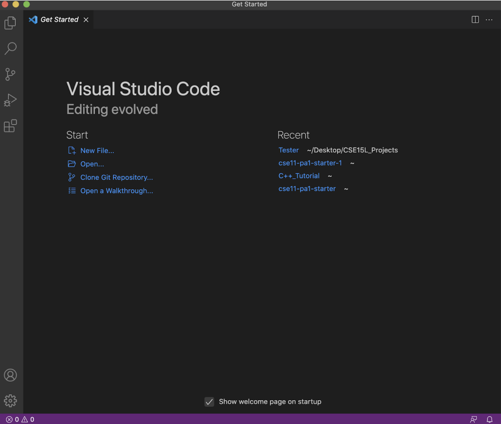
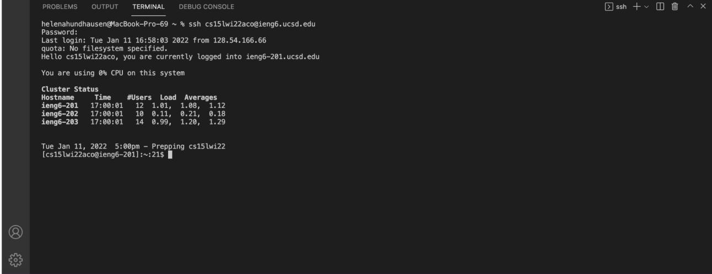

**CSE15L Week 2 Lab Report 1 by Helena Hundhausen** 
======================================================
Logging Into A Course-Specific Account On ieng6
-------------------------------------------------------

*Background*    : 

Software Engineers can't store a company's large amounts of data on their personal computer to complete their work, requiring them to access a personalized account from their local computers to a remote machine. To understand and replicate how this process works this lab and the steps below, show how to use a CSE15L course-specific account to access a computer in the CSE basement. 

*Step One*    : Installing Visual Studio Code 

Visual Studio Code is an Integration Development Environment (IDE) for macOS, Windows, and Linux, with integrated terminal access. Installing VS Code is important because we will use its integrated terminal palette to access our course-specific account on ieng6 and complete the remaining steps in this lab. 

>To download and install VSCode: 
1. Depending on the computer you're using different versions of VS Code are available. For a link to all versions, click [here](https://code.visualstudio.com/Download)! 
2. Then, click [here](https://code.visualstudio.com/docs/setup/setup-overview) for more information on the steps needed to finish installing VS Code onto the type of computer its downloaded on. 
3. Once installed, you'll be able to open a window very similar to the screenshot below...

*Step Two*   : Remotely Connnecting 
>To 

1. Access your CSE15L course specific account
1. Open a **terminal** in VSCode 
2. Insert the command **ssh cs15lwi22zz@ieng6.ucsd.edu** (make sure to replace *zz* with your own specific three letter sequence) 
3. Put in the password previously created, it takes about 15-20min for the password to update if you recently resetted it 
- If this is the first time connecting to the server, you'll getting a message to continue connecting please type **yes** 
4. Similary in the screenshot starting on line 3,once you successfully logged-in you will be informed when you last time logged-in and other account specific information 
5. Your terminal is now connected to a computer in the CSE basement and any commands you run will run on that computer

*Step Three* : Trying Some Commands 

To demonstrate how any commands that are run will run on the computer in the CSE basement on the screenshot after ssh-ing a few specific commands were run. Here are their descriptions... 

> 

 

*Step Four*  : Moving Files with scp 

*Step Five*  : Setting an SSH Key 

*Step Six*   : Optimizing Remote Running 

