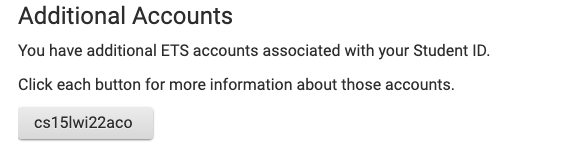
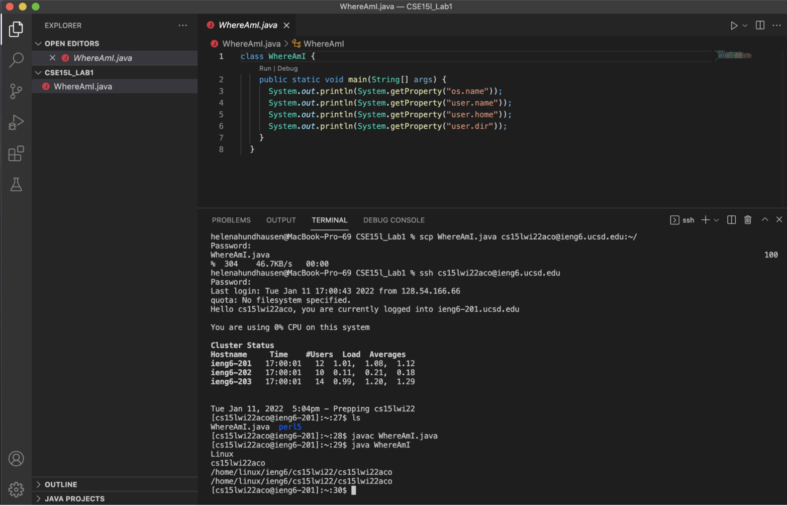
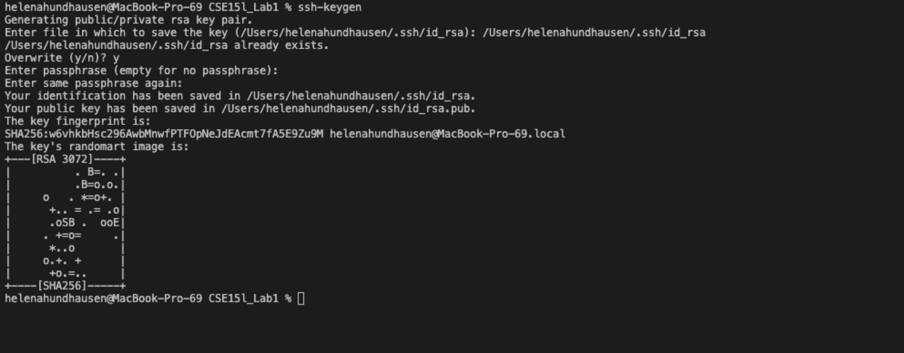

# **Week 2 Lab Report 1** 

---
# Logging Into A Course-Specific Account On ieng6

---

*Background*    : 

Software Engineers often do not have the space to accommodate their company's large amounts of data on their local machines, so they must access it from a remote machine using a personalized account. 

Moreover, when working with a large amount of data accessing a remote machine may be necessary to understand how this process works; this lab and the steps below demonstrate how to gain access to a computer in the CSE basement using a CSE15L course-specific ieng6 account. 

*Step One*    : Installing Visual Studio Code 

Installing Visual Studio Code, an Integration Development Environment (IDE), is important because this lab uses its integrated terminal palette to gain access to our CSE15L course-specific account on iegn6. 

>To download and install VS Code: 
1. Depending on the computer you're using, different versions of VS Code are available. For the link to all versions, click [here](https://code.visualstudio.com/Download)! 

2. Now, click [here](https://code.visualstudio.com/docs/setup/setup-overview) for more information on the steps needed to finish installing VS Code onto the type of computer it's downloaded on!

3. Once fully installed, you'll be able to open a window very similar to the screenshot below...
* * Note that I've changed specific settings in my VS Code, so my screenshot may look slightly different from the window you have opened 

*Step Two*   :  Remotely Connnecting 

In order to connect to the computer in the CSE basement, we have to obtain a course-specific ieng6 account. 

>If you haven't found your account yet, follow these steps: 
1. Click here for [account lookup!](https://sdacs.ucsd.edu/~icc/index.php) 
2. Enter your AD and Username 
3. Find the CSE15L ieng6 specific account under *additional accounts*; it should very similar to *"cs15lwi22aco"*
* Remember: the three-letters at the end **aco** should be replaced with your particular combination 

4. Then, click on your account to reset the password 
* To avoid problems in the following steps, make the password short and straightforward while still secure 

>If you've gained access to your account, follow the steps below to establish a new terminal in VS code and enable a secure connection to the remote computer using a command called **ssh**. 
1. Open a new terminal in VS Code 
2. Insert the command *ssh* along with your course-specific account ending it with *@ieng6.ucsd.edu* to get the remote location
* It should look like the following: **ssh cs15lwi22aco@ieng6.ucsd.edu** (be sure to replace *aco* with your specific three-letter sequence) 
* * To save time, I highly recommend keeping your couse specific account in a place where you can easily copy and paste it rather than having to type it out every time
3. Enter the password you've previously resetted
* If you're having trouble with this step, please understand...
* * It takes about 15-20min for the password to reset
* * There could be minimal typos, so go back and check previous lines 
4. If you successfully log in, you'll receive a bunch of account-specific information 
* For reference, the information that appears should resemble what is seen in the screenshot below, beginning on line 3

Your terminal is now connected to a computer in the CSE basement!

*Step Three* : Trying Some Commands 

One important and noteworthy about *ssh* is that commands on your local computer will be executed on the remote computer while you're connected to the secure connection it establishes. The screenshot below provides a demonstration of the different commands I tested for fun. 

Feel free to experiment on your VS Code! 

*Step Four*  : Moving Files with scp 

Another essential ability to learn is transferring files back and forth between the local/remote computers using a command called *SCP*.

>To move files follow these steps:  
1. Make sure you're not logged into the remote computer 
2. Create a .java file on your computer 
*  Feel free to copy the *WhereAmI.java* file on the screenshot below
3. Log into the terminal from the directory where the file was made and run the *scp* command along with your personal username to log back into the remote computer
* scp WhereAmI.java cs15lwi22aco@ieng6.ucsd.edu:~/
4. Enter your password 
5. Try the command *ls* to list the file

A visual example can also be found in the screenshot below. 

The *scp* command, however, takes a long time, and if you had to run it throughout a PA or anything else, simply checking to see whether you had the required output would be very time-consuming. Within the next steps, we'll see how to resolve this problem. 

*Step Five*  : Setting an SSH Key 

Every time we've had to log in or run *scp*, a password that isn't visible had to be typed for security purposes. Yet, a helpful command called *ssh-keygen* allows us not to have to type a password for *ssh*. The command is able to solve this problem by creating a pair of files on your local computer called: 
 - public key(stored in a file id_rsa.pub) 
 - private key(stored in a file id_rsa) 

The first screenshot right below shows the steps needed to complete the first part of using ssh-keygen by generating the public key and private key.  
>Before continuing, read here for important information and clarification:  
- When prompted to enter a new password, press "enter" since we longer want to have to endure the pain of password entering
- Also we don't need to type a password because we aren't engaging with very secure data 

Now the *public key* and *private key* are generated follow the steps in the screenshot right below to understand how to copy the *public key* and create a *.ssh directory* to put it onto your course-specific account's server. 

*Step Six*   : Optimizing Remote Running 

Now that we don't need to input a password to ***ssh*** or ***scp***, we can concatenate the command with other commands, such as the ones previously tested, to make editing locally a lot more efficient. 

The screenshot below displays a few examples. Overall, this step is very convenient and saves a lot of time. 

You've completed and read all of this lab report's step!

