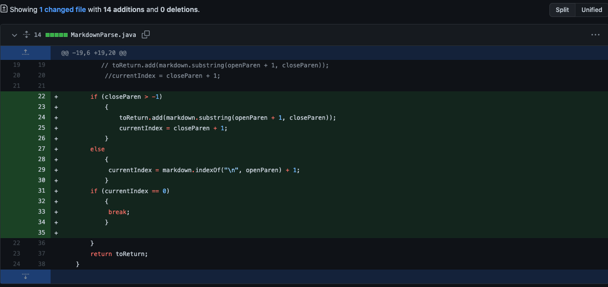
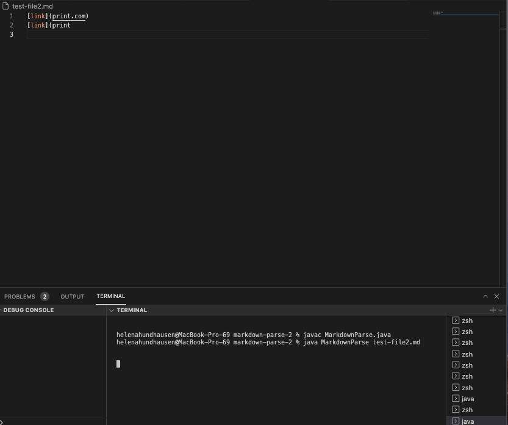
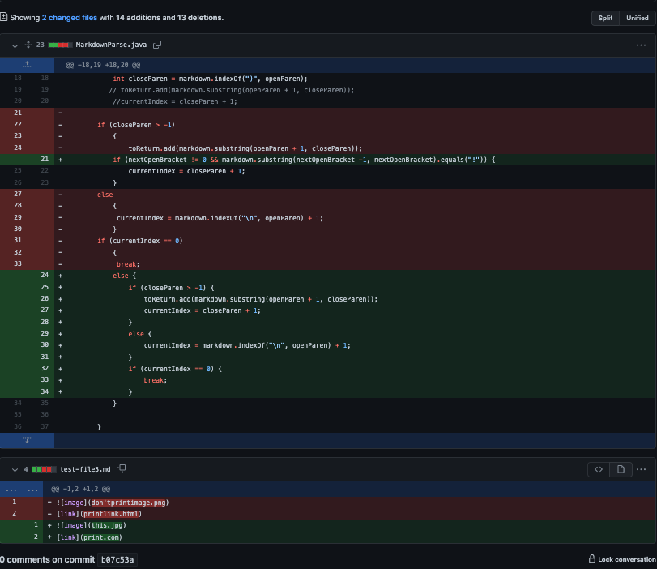
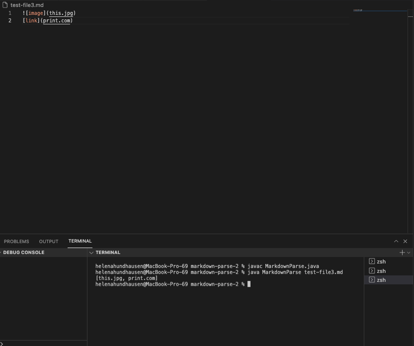
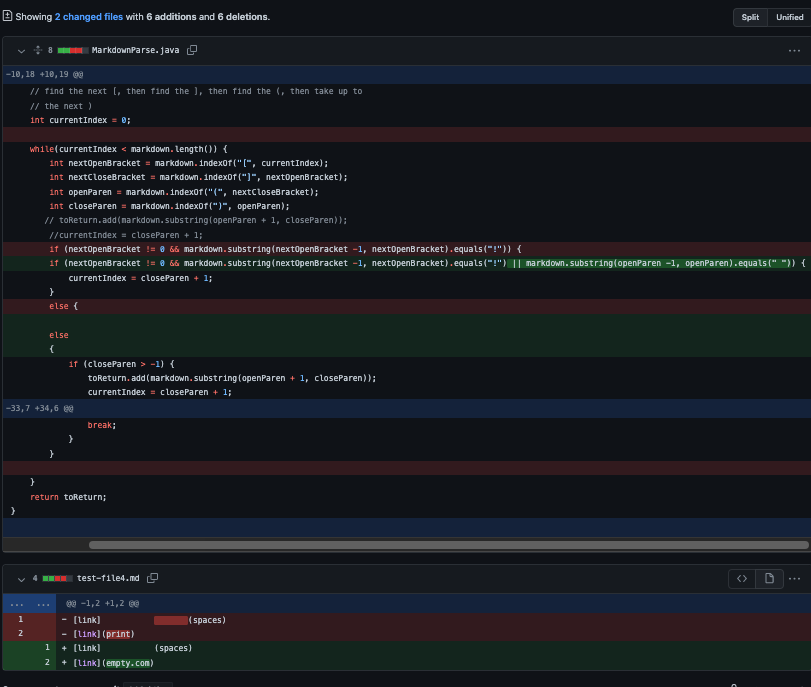
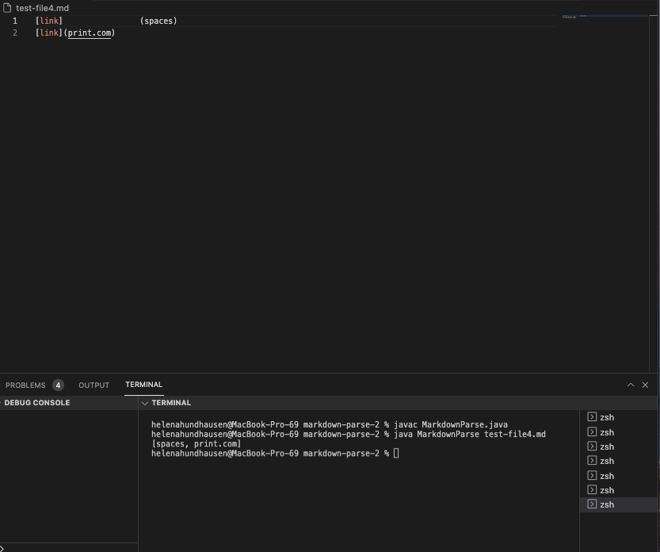

# **Week 4 Lab Report 2**

# Code Change One: *A File With An Open Parenthesis*
- Screenshot of the *code change* from **Github**: 


- [Click Here](https://github.com/hhundhausen/markdown-parse/commit/f0c2ad90724fe02d9e647ab3ade0b4b8b8c3160b) to access the link to the test file for a *failure-inducing input* that prompted the code change!

- Screenshot of the *symptom* of the failure-inducing input: 



- In this computer program, the failure-inducing input was a file that had an open parenthesis at the end (this is shown in the screenshot above). For better reference, it was similar to: ```[link](print.com```
* * Yet, this input caused a bug in the computer program of not having the right syntax for a file which thus created a symptom, a faulty in the program behavior, to be an infinite loop. 

# Code Change Two: *A File With An Image Reference* 
- Screenshot of the *code change* from **Github**: 


- [Click Here](https://github.com/hhundhausen/markdown-parse/commit/fc66a3fd7e838833d1364a7b26ea1be939d94948) to access the link to the test file for a *failure-inducing input* that prompted the code change!

- Screenshot of the *symptom* of the failure-inducing input: 



- In this computer program, the failure-inducing input was a file that had an image reference (this is shown in the screenshot above).For better reference, it was similar to: ``````.
* * However, this input caused the bug of having the wrong syntax, and made the image appear as a link. Additionally, the input and bug had the program produce a symtom which was printing the image name along with the other file names. 


# Code Change Three :  *A File That Uses [] and (), But Very Far Apart*
- Screenshot of the *code change* from **Github**: 


- [Click Here](https://github.com/hhundhausen/markdown-parse/commit/decb1c81008ef03d0367d92e36876aecb25f0efe) to access the link to the test file for a *failure-inducing input* that prompted the code change!

- Screenshot of the *symptom* of the failure-inducing input: 



- In this computer program, the failure-inducing input was a file that used a pair of brackets **[]** and a pair of parenthesis **()**, but were very spaced out from each other (this is shown in the screenshot above). For better reference, it was similar to: ```[link]                  (space)```
* * However, this input caused a bug because the syntax for a link was incorrect and the program exectued very similar behavior to the program above by outputing the link that was syntactically inccorect with the links that were correct. Thus, the symptom of having an incorrect output occured due to the input and bug. 