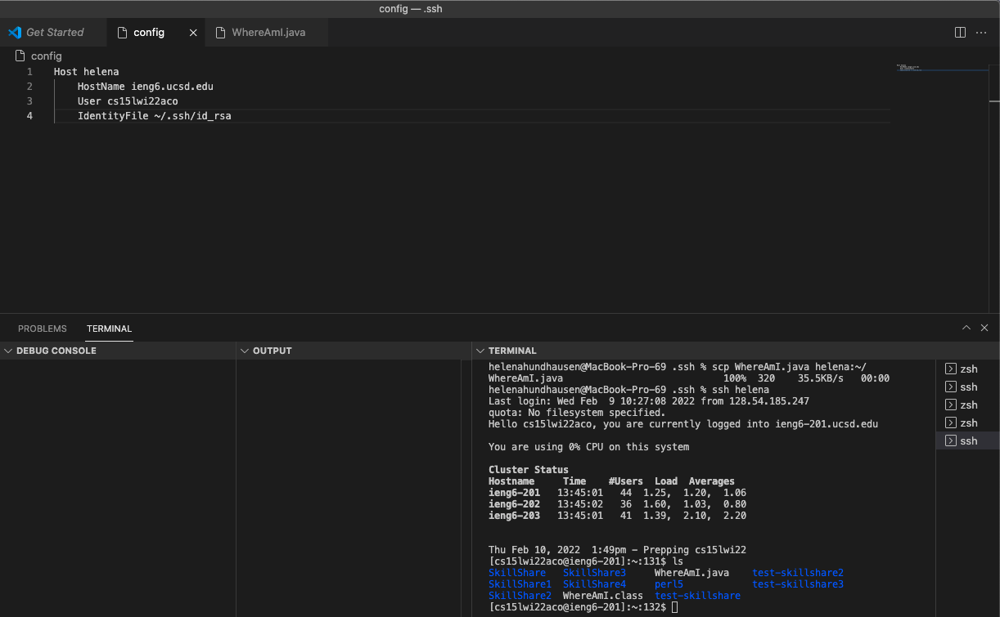

# # Week 6 Lab Report 3 
---
# Streamlining ssh Configuration 
---

# Step 1) Editing .ssh/config File

Logging into ``ieng6`` from my computer has previously been a very tedious task, and the following line of code was a lot that would be have to typed everytime. 
- ``$ssh cs15lwi22aco@ieng6.ucsd.edu``

Additionally, becuase it was so long there were a lot of problems such as remembering it and grammar mistakes would happen at least once everytime when typing it out. However, this step shows that SSH has configuration files that allow me to save a lot time from typing. 

To understand exactly the process of completing this was that in ``~/.ssh/config`` (which tells SSH what user-name to use when logging into specific servers), I was able to give a specific nickname using the lines of code that are presented in the screenshot below. 

# Step 2) SSH Command Logging Into ieng6 Account Using Alias Created 

After adding ``config`` file along with the code within the it(shown in the step above) and saving it, I was able to use the ``ssh`` command with only having to enter the alias I created which was my name ``helena``. This was an exteremly quicker line of code to write compared to the previous one. 

Additionally, it originally took me **34 keystrokes** with the original username with the original line of code: 
- ``$ssh cs15lwi22aco@ieng6.ucsd.edu``

But, now it takes me **11 keystrokes** with the new username when trying to enter the ``ssh command``: 
- ``$ssh helena``

This has saved more than half the amount of time it originally took and the proability for errors significanlty decreased because I was able to type in a username that is simple for me to remember/type. 

It allowed me to use the key and log in with the username I specificed by using my public key. 

Additionally, this step is presented as a visual referance in the screenshot below. 

# Step 3: SCP Command Coping A File to Account Using Alias Created

This step is very similar to the one above. I used the ``scp`` command to copy a file ``WhereAmI.java`` to my ``ieng6`` account using the specific username created ``helena``. 

Additionally, following is the original line of code which took **39 keystrokes**:  
- ``$scp cs15lwi22aco@ieng6.ucsd.edu~:\``

But now with the username created the following line of code uses the same commade and only takes **16 keystrokes**: 
- ``$scp helena~:\``

Again, by creating this "alias" a lot of time is saved. 

Additionally, this step is presented as a visual referance in the screenshot below. 

Thank you for reading this lab report! You've reached the end. 