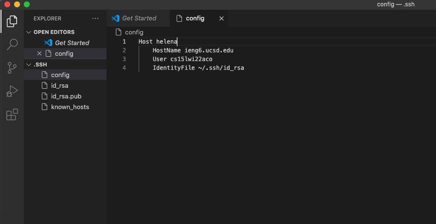
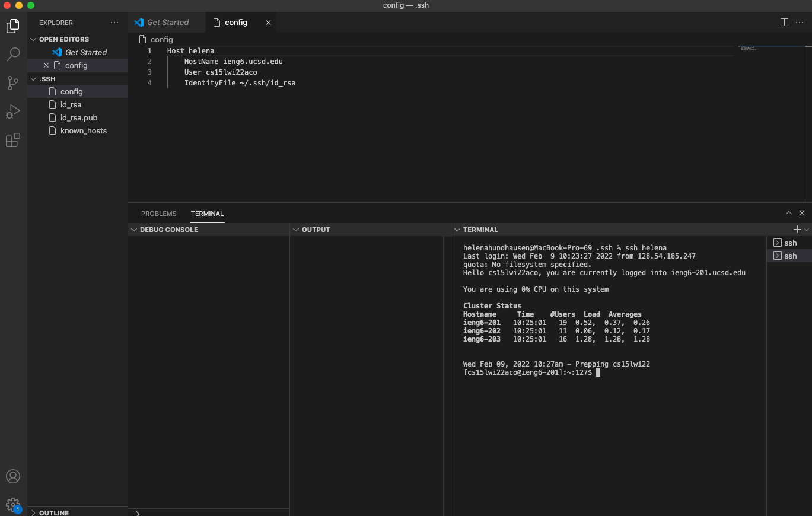
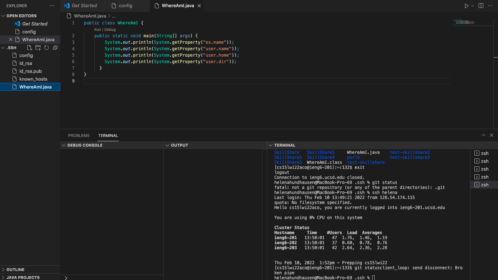

## Week 6 Lab Report 3 
---

# Streamlining ssh Configuration 
---

# Step 1) Editing .ssh/config File

Logging into ``ieng6`` from my computer has previously been a very tedious task, and the following line of code was a lot that would have to be typed every time. 
- ``$ssh cs15lwi22aco@ieng6.ucsd.edu``

Additionally, because my log-in was very long, many problems constantly occurred, such as remembering it and minor grammar mistakes. 

However, this step shows how the SSH configuration files ``~/.ssh/config`` (which tells SSH what username to use when logging into specific servers) have saved me a lot of time by creating a particular username. Moreover, I created a log-in with the username I specified using my public key. 

For visual reference, this step and the code used to create the username are presented in the screenshot below. 

# Step 2) SSH Command + Alias Created to Log into ieng6 Account 

After adding the ``config`` file to ``~/.ssh`` along with the code within it (shown in the step above), I could concatenate the alias created ``helena`` with the ``ssh`` command. Ultimately, this was a significantly faster line to write than the previous one. 

Originally, it took me **34 keystrokes** when using the previous log-in and the ``ssh command``:  
- ``$ssh cs15lwi22aco@ieng6.ucsd.edu``

Now, it takes me **11 keystrokes** with the new username and the ``ssh command``: 
- ``$ssh helena``

Overall, I have saved more than half the amount of time and decreased the likelihood of running into errors because I created a username that was simple and easy to remember/type. 

For visual reference, this step is presented in the screenshot below. 

# Step 3: SCP Command Coping A File to Account Using Alias Created

This step is very similar to the one above because I used the ``scp`` command to copy a file ``WhereAmI.java`` to my ``ieng6`` account using the specific username created ``helena``.

Originally, it took me **39 keystrokes** when using the previous log-in and the ``scp command``:  
- ``$scp cs15lwi22aco@ieng6.ucsd.edu~:\``

Now, it takes me **16 keystrokes** with the new username and the ``scp command``: 
- ``$scp helena~:\``

Ultimately, this step is an excellent representation of how creating a new alias can save time using any command. 

For visual reference, this step is presented in the screenshot below. 

Thank you for reading this lab report! You've reached the end. 