# Lab Report 4 Week 8 
---

# 1) Repository Links 
- For the link to Markdown-Parse Repository : [click here!](https://github.com/hhundhausen/markdown-parse) 
- For the link to Markdown-Parse Reviewed Repository : [click here!](https://github.com/ajwboi/markdown-parse)

# 2) Snippet's Expected Outputs 
- **Snippet 1** : 
[google.com, 'google.com, ucsd.edu]

- **Snippet 2** : 
[a.com, a.com(()), example.com]

- **Snippet 3** : 
[https://www.twitter.com, https://ucsd-cse15l-w22.github.io/, https://cse.ucsd.edu/]

# 3) Code Turning Snippet's Into Tests In ``MarkdownParseTest.java``

**Snippet 1 :**

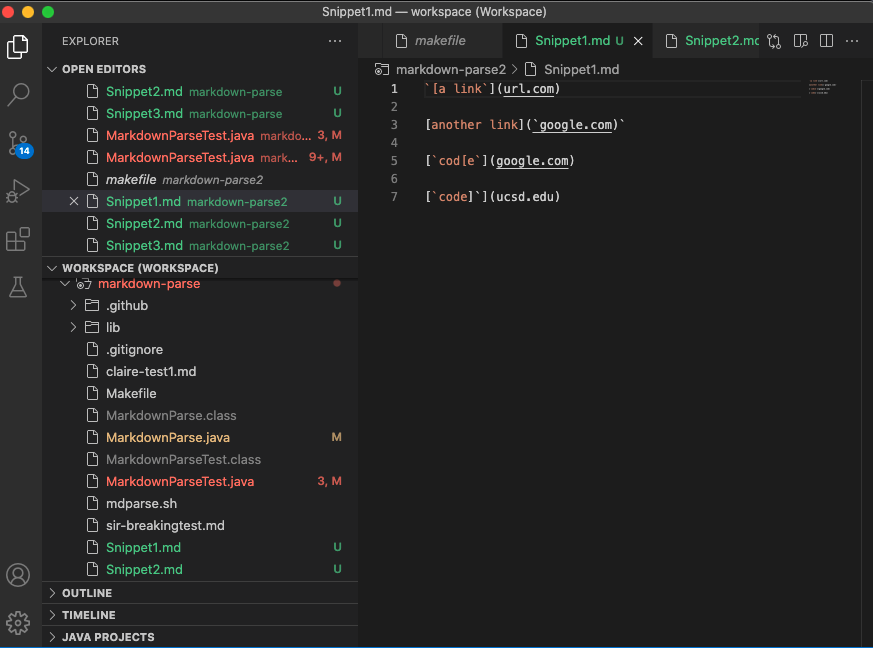

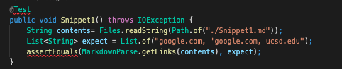

**Snippet 2 :**

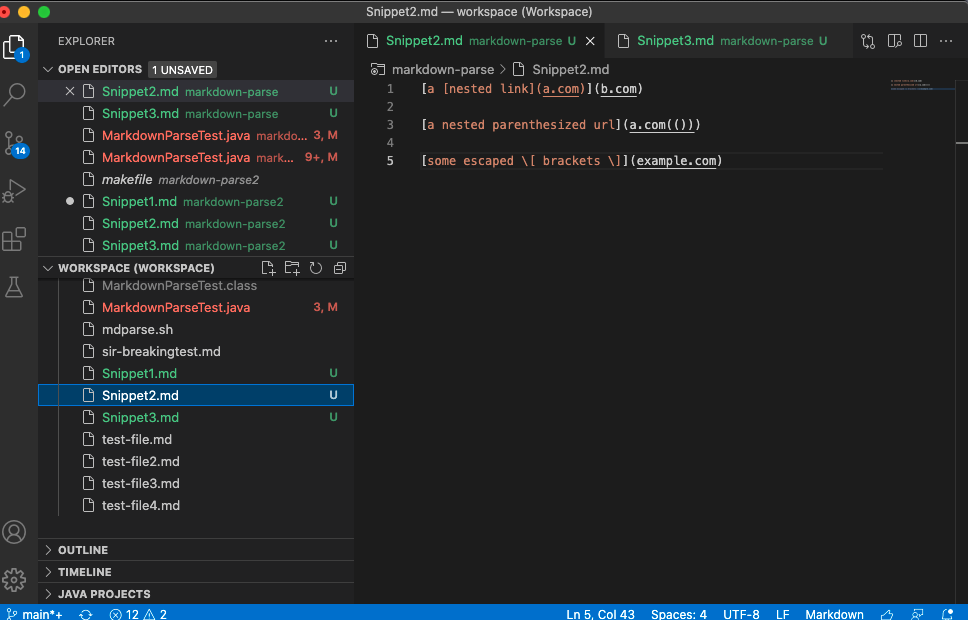

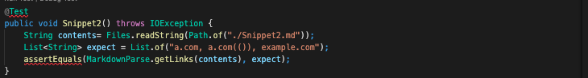

**Snippet 3 :** 

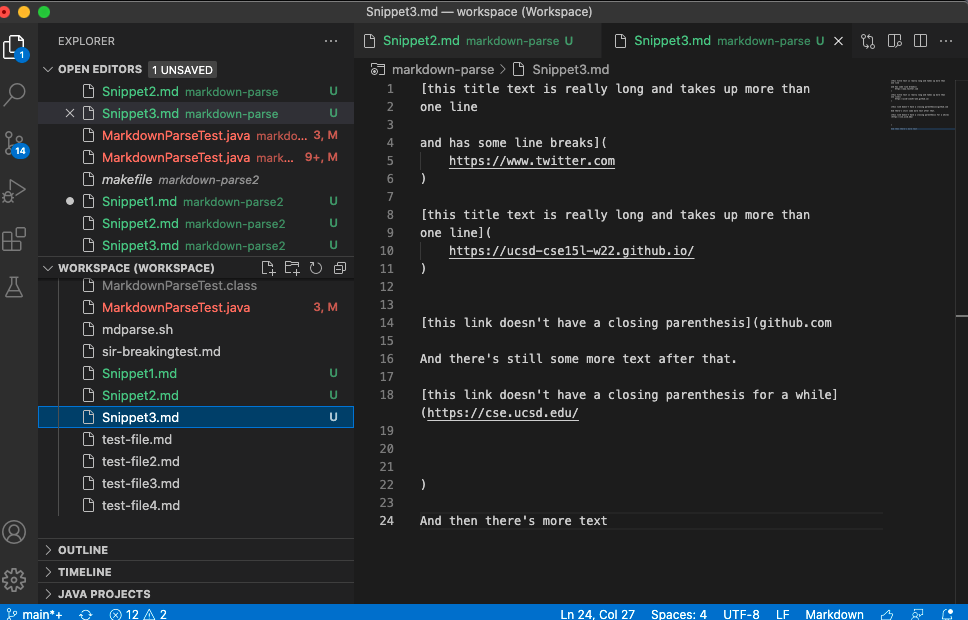

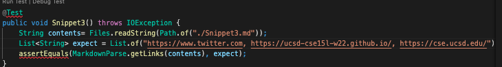

# 4) Implementations 
---
# Reviewed ``MarkdownParse.java`` Implementation: 

- **Image of the corresponding output when running tests from the reviewed ``MarkdownParse.java``:** 
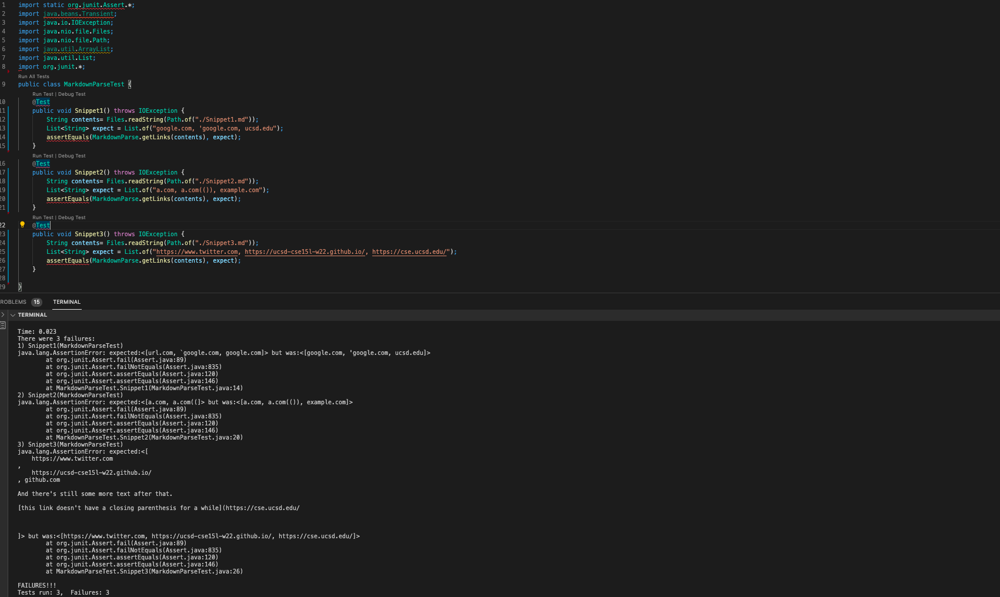

**Specific *Snippet 1* Output :** 
- Snippet 1's test doesn't pass. Attached below is an image from the specific part of the JUnit output that shows the test failure.

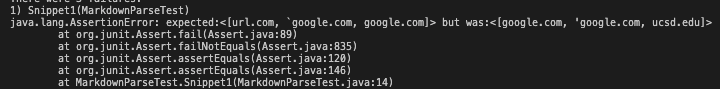

**Specific *Snippet 2* Output :** 
- Snippet 2's test doesn't pass. Attached below is an image from the specific part of the JUnit output that shows the test failure.

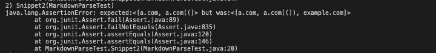

**Specific *Snippet 3* Output :** 
- Snippet 3's test doesn't pass. Attached below is an image from the specific part of the JUnit output that shows the test failure.

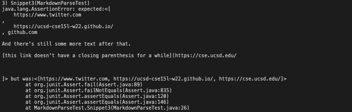

---
# My ``MarkdownParse.java`` Implementation :

- **Image of the corresponding output when running tests from my ``MarkdownParse.java``:** 
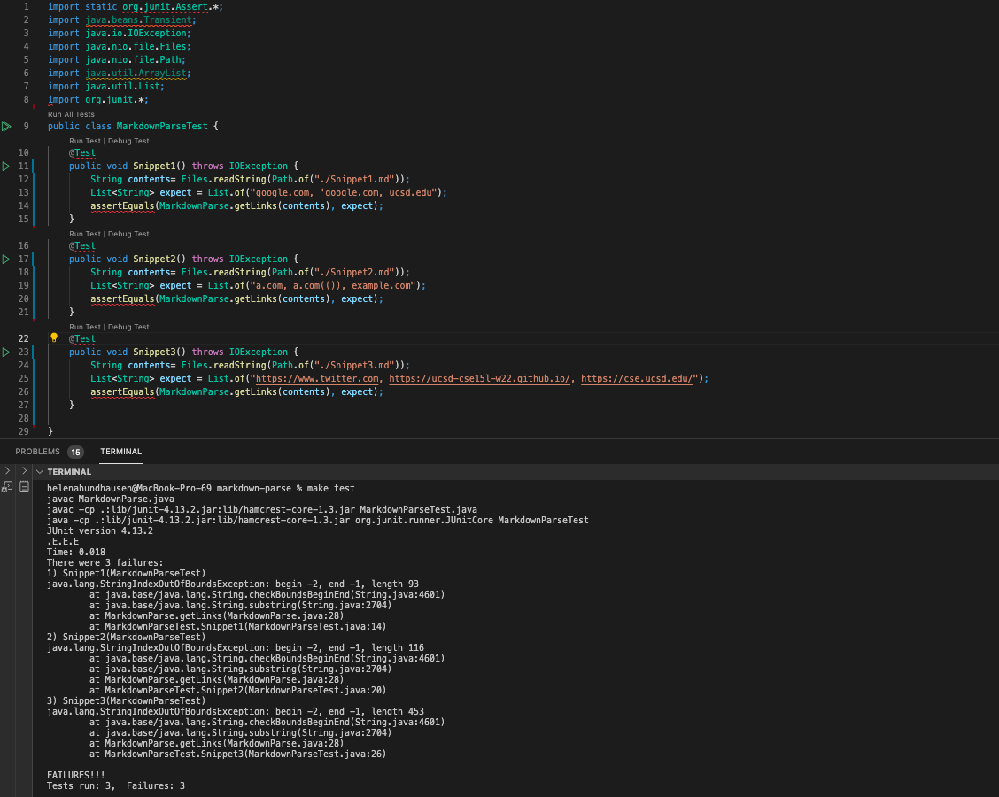

**Specific *Snippet 1* Output :** 
- Snippet 1's test doesn't pass. Attached below is an image from the specific part of the JUnit output that shows the test failure.

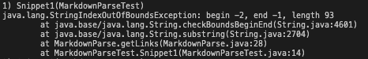

***Snippet* 1 Free-Response Question :** 

For my program to work for **Snippet 1**, I think a small change to my code is needed. Additionally, the test for **Snippet 1** outputs a ``StringIndexOutOfBoundsException`` failing on *line 28* due to pairs of nested brackets in the ``Snippet1.md`` file. Therefore, it is possible to resolve the issue by making the program determine the most internal pair of brackets and reassigning it to the bracket variables. 

**Specific *Snippet 2* Output :** 
- Snippet 2's test doesn't pass. Attached below is an image from the specific part of the JUnit output that shows the test failure.

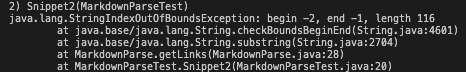

***Snippet 2* Free-Response Question :** 

For my program to work for **Snippet 2**, I think a small change to my code is needed. Furthermore, the test for **Snippet 1** generates a ``StringIndexOutOfBoundsException`` on *line 28* for a similar reason as for **Snippet 1**, the pairs of nested brackets found in the ``Snippet 2.md`` file. Therefore, it is possible to resolve the exception in a similar way to resolving **Snippet 1**, which is having the program determine the most internal pair of brackets and reassigning it to the bracket variables. 

**Specific *Snippet 3* Output :** 

- Snippet 3's test doesn't pass. Attached below is an image from the specific part of the JUnit output that shows the test failure.

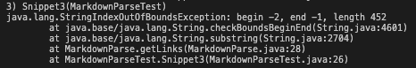

**Snippet 3 Free-Response Question :** 

For my program to work for **Snippet 3**, I think a bigger code fix is needed. Additionally, the test for **Snippet 3** outputs a ``StringIndexOutOfBoundsException`` on *line 28* due to a significant issue. Based on the content of the ``Snippet3.md`` file, the program can print any number of lines with any amount of spacing between brackets and parenthesis, but only if there is a link with the correct syntax following. The lines following are an example demonstrating what the program is only able to output without an exception: 

``This line is a line. ``

``[this title text is really long and takes up more than`` 
``one line``

``and has some line breaks](``
    ``https://www.twitter.com``
``)``

``[another link!](some-page.html)``

Therefore, I think a change of more than ten lines of code will be needed. Since, the program needs to accept any number of lines and space between brackets and parenthesis without a link with correct syntax to follow it. 

    

    

   