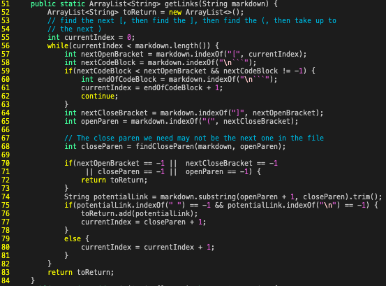
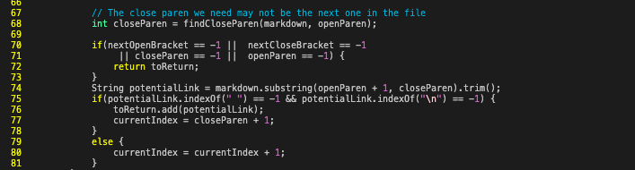

# Lab Report 5 Week 10 
---

# Links

Link To Lab Group Repository: [click here!](https://github.com/smissula/markdown-parse)

Link To Lastest Shared Markdown Parse: [click here!](https://github.com/ucsd-cse15l-w22/markdown-parse)

# Difference #1 

Difference #1 Features
- The difference appears on line : *211*
- The difference is from the test file : ``194.md``
- The contents of the test file ``194.md`` : 

``[Foo*bar\]]:my_(url) 'title (with parens)' ``
 
`` [Foo*bar\]]``

Difference #1 Outputs
- Test file ``194.md`` expected output : ``[]``
- Lab Group Output : ``[]``
- Shared Markdown Parse Output : ``[url]``

I used the program ``diff`` to compare the tests and identify different results. Then I used the ``vim`` command to view the specific content of the ``.md`` file to find the expected output and determine which implementation had the bug.

When reviewing the content of the test file ``194.md`` it appeared that the expected output should be empty brackets ``[]`` because it only contained links with incorrect syntax. 

Therefore, when comparing the differences, the correct implementation is my lab group because the program’s output was empty brackets ``[]``. While, the shared markdown parse program printed a url, ``[url]``.
 
For the shared markdown parse to print empty brackets, there is a bug, a problem in the code, that needs to be resolved. Currently, after finding the pair of brackets ``[]``at the start of each link, the program will find the first pair of parentheses ``()``. However, the program does not consider if there is text/characters between the closing bracket ``]`` and opening parenthesis ``(``. 

To fix the program, it needs to search and find the first opening parenthesis right after the last closing bracket; both should be right next to each other ``](``. If both are next, the program should return and move on to the following line. 

The specific part of ``MarkdownParse.java`` that should be fixed is in the ``getLinks()`` method from lines **68** to **73**. The screenshot below visually shows this particular area in the program that should implement this solution. 

# Difference #2  

Difference #2 Features
- The difference appears on line : *269* 
- The difference is from the test file : ``22.md``
- The contents of the test file ``22.md`` : 

``[foo](/bar\* "ti\*tle")``

Difference #3 Output
- Test file ``22.md`` expected output: ``[/bar\* "ti\*tle"]``
- Lab Group Output : ``[/bar\* "ti\*tle"]``
- Shared Markdown Parse Output : ``[]`` 

I used the program ``diff`` to compare the tests and identify different results. Then I used the ``vim`` command to view the specific content of the ``.md`` file to find the expected output and determine which implementation had the bug.

When reviewing the content of the test file ``22.md``, it appeared that the expected output should be ``[/bar* “ti\*tle”]`` because it contains a link with the correct syntax. 

Therefore, when comparing the differences, the correct implementation is my lab group because the program’s output was a link ``[/bar* “ti\*tle”]``. While the shared markdown parse gram printed empty brackets ``[]``. 

For the shared markdown parse to print the link, there is a bug, a problem in the code, that needs to be resolved. Currently, the program considers the condition of when the closing parenthesis ``)`` may be on a different line in the file, but not if there is a space between words/characters in the link. Therefore, to fix the program, it needs to allow any amount of spacing between words/characters in the first pair of parenthesis ``()``.

The specific part of ``MarkdownParse.java`` that should be fixed is in the ``getLinks()`` method. The screenshot below visually shows this particular area in the program that should implement this solution. 

